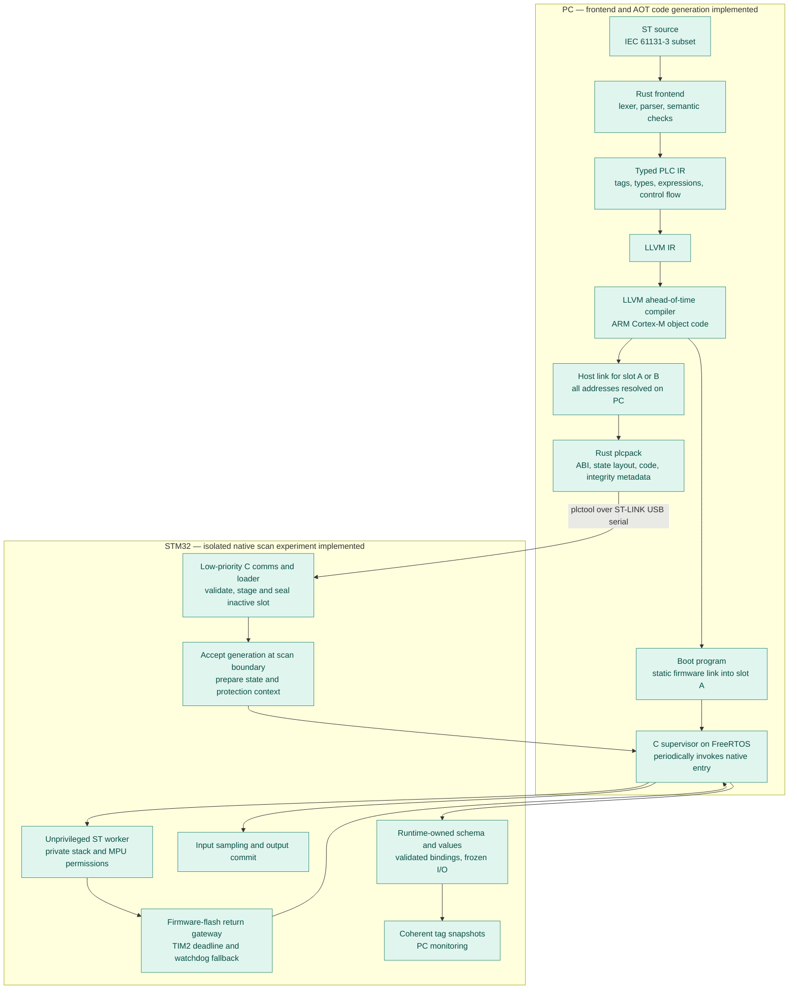
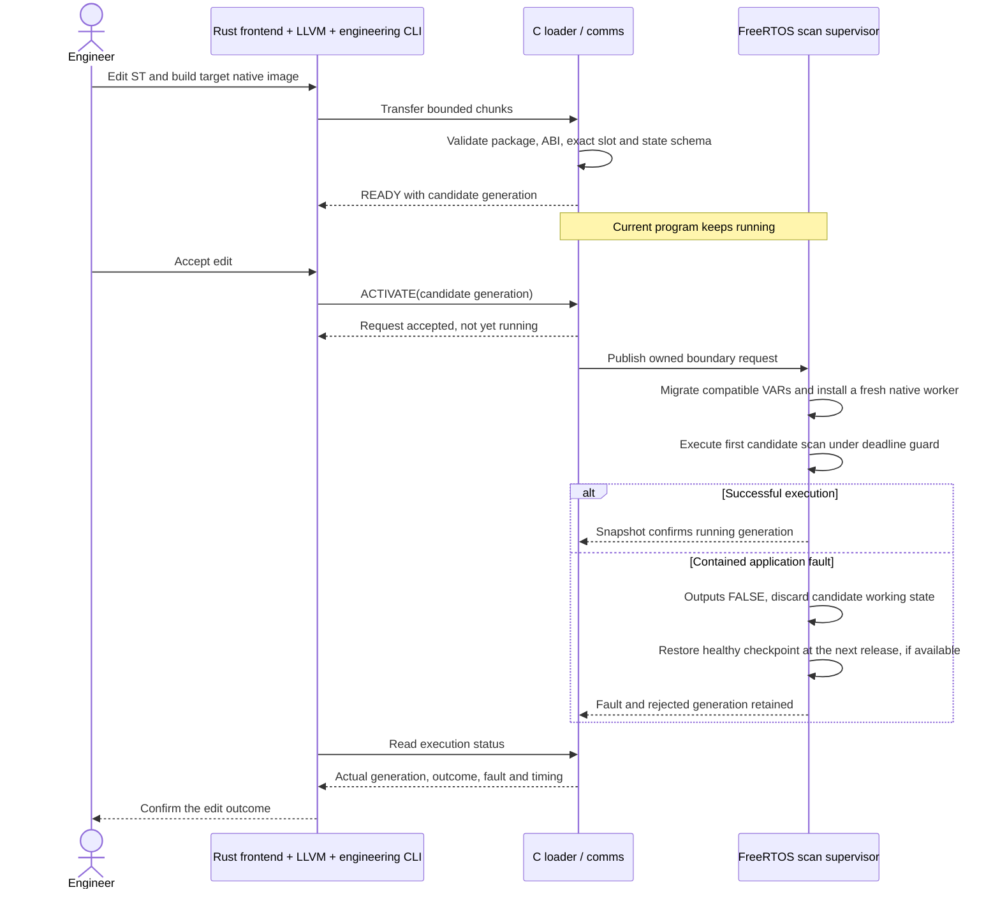

# tinyplc

A research PLC built around **Structured Text → Rust frontend → LLVM IR →
ahead-of-time machine code → a C runtime on FreeRTOS/STM32**. LLVM runs on the
PC. The microcontroller schedules and executes already-compiled user logic.
The initial target is the NUCLEO-F446RE.

**Education and research only. Do not use tinyplc for real machines or safety
functions.** Output fault handling is not a certified safety system.

Repository: [sergiogallegos/tinyplc](https://github.com/sergiogallegos/tinyplc).

## Current state: compile, download and activate native ST on STM32

Implemented: a dependency-free Rust ST frontend, positioned diagnostics,
separate typed PLC IR, textual LLVM IR emission, exported tag metadata, and a
C-compatible scan entry point. Tests verify IR, execute host machine code at
`-O0` and `-O2`, compare results with independent historical interpreters, and
cross-compile to ARM Cortex-M object code. A static FreeRTOS task now runs
linked ST machine code from RAM on the F446, samples PC13, commits PA5, latches
faults and measures the 10 ms release schedule. ST now executes in a separate
unprivileged task, with checked return, MPU isolation, TIM2 deadline abort and
IWDG reset fallback. R2 is complete; see the [consolidated report](docs/R2-report.md).

The [R3.1 wire contract](docs/wire-format.md) now defines native packages and
engineering frames, with generated Rust/C constants and golden fixtures.

[R3.2](docs/R3.2-report.md) adds the Rust native packager and portable C
package validation/staging, tested together on the host.

[R3.3](docs/R3.3-report.md) connects the board over USB serial: `plctool` downloads
into an inactive slot, explicitly activates a generation, and reports execution
status. Downloaded code runs unprivileged with validated tag bindings and a
fresh worker context. Both slots and 64-tag execution have hardware evidence.

[R3.4](docs/R3.4-report.md) adds owned snapshots and `plctool DEVICE monitor`,
with host concurrency tests and target build validation.
[R3.5](docs/R3.5-report.md) verifies the full board workflow and mixed download/monitor
traffic: a 4.054 ms maximum observed scan body within the 10 ms period, with no
missed releases in the recorded run. R3 is complete.

[R4](docs/R4.2-report.md) adds compatible VAR migration, a reserved first-scan
trial and one-use rollback to saved pre-update state. [Board evidence](docs/R4.3-report.md)
covers 64-tag reorder, contained faults, recovery failure and reset behavior.

[R5.1](docs/ton.md) adds native TON on-delay timers and millisecond TIME values,
with frozen clock input and explicit restart behavior for online changes. See
[the example](examples/ton_led.st) and [acceptance report](docs/R5.1-report.md).

**Not implemented yet:** tag writes, persistence or broader language types.

The primary compiler is `compiler/` (Rust). Earlier Python/bytecode work is
retained only as a historical semantic test reference; it is not the product
architecture or a planned fallback execution mode.

## Try it on the PC

Use existing Rust/Cargo, LLVM (`clang`, `llvm-as`, `opt`), Python 3.11+, CMake,
a C compiler, and ARM GNU ld for the package integration tests. No packages are fetched by these commands.

```sh
make compiler
./target/debug/plcc examples/button_led.st -o /tmp/button_led.ll
make run
make aot-arm
make test
```

`make run` compiles the example through Rust and LLVM, links it with a C host
harness, and prints `R1 AOT scans=5 LED=1 N=2`. `make aot-arm` creates
`build/aot/button_led.arm.o`, an ARM relocatable object. It does not upload,
link firmware, or flash a board. [Compiler usage and ABI](compiler/README.md)
and [setup](docs/setup.md) give exact reproduction commands.

## Compile, upload, and run on the board

The NUCLEO-F446RE must already have the current R5.1 runtime firmware installed
through ST-LINK. Firmware prerequisites and build instructions are in
[setup](docs/setup.md) and the [target toolchain guide](docs/target-toolchain.md).
The following workflow uploads an ST program through the ST-LINK virtual serial
port; it does not replace the runtime firmware.

After a board reset, the boot program occupies slot A and slot B is available.
Use your actual serial device path and installed toolchain paths:

```sh
make compiler
mkdir -p build/programs
PLC_DEVICE=/dev/cu.usbmodem2103
./target/debug/plctool "$PLC_DEVICE" info
./target/debug/plcpack examples/ton_led.st --slot B -o build/programs/ton-b.tplc \
  --clang /path/to/clang --ld /path/to/arm-none-eabi-ld
./target/debug/plctool "$PLC_DEVICE" download build/programs/ton-b.tplc
```

`plcpack` compiles ST, generates ARM code, links for the chosen slot, and builds
the download package. Download returns a JSON `ready_generation`; substitute
that number for `GENERATION` below:

```sh
./target/debug/plctool "$PLC_DEVICE" activate GENERATION
./target/debug/plctool "$PLC_DEVICE" status
./target/debug/plctool "$PLC_DEVICE" monitor
./target/debug/plctool "$PLC_DEVICE" update-status
```

Activation starts execution on the board's **10 ms scan cycle**. In this example,
hold BTN for 500 ms to light LED; releasing BTN clears the timer and LED on the
next invocation. `monitor` prints one coherent snapshot, including TON Q/ET
and the clock; run it again for another sample. TIME values are milliseconds.

For subsequent edits, inspect `info` and build for the inactive slot: A is
`0x20010000`, B is `0x20014000`, and ACTIVE has state 1. The download command
rejects a package built for the wrong available slot. Downloading only stages
code; `activate` is required to run it. See [package usage](packager/README.md)
and [engineering commands](engineering/README.md) for details.

Healthy online updates preserve matching scalar VAR names/types. TON instances
restart their delays. `plctool "$PLC_DEVICE" rollback` restores the saved previous
program and scalar state when a checkpoint is available; timers restart again.
Starting another download retires that checkpoint. Downloads and state are
RAM-only: reset or power loss returns to the firmware's boot program.

## How the system works

### 1. Compile on the PC; execute on the controller



Green is implemented; the R3.4 report distinguishes host tests from board evidence. The C
runtime is firmware installed through ST-LINK. The user program is a separate
native artifact downloaded through the engineering connection. A general
Linux `.so` or an unqualified raw `.bin` is not our MCU loading contract.

### 2. Scan ownership and monitoring

**Full target design.** Scheduling, sampled inputs, working/committed state,
physical outputs, fault latching, unprivileged execution and native deadline
abort are implemented in the [scan supervisor](docs/scan-runtime.md) and
[execution boundary](docs/native-isolation.md). Owned tag snapshots are implemented in R3.4; tag-write boundary requests remain planned.


Comms never reads a tag by racing a live write or retaining a pointer into a
reusable program slot. A snapshot contains values **and** names/types/scan and
generation identifiers. A slow monitor may miss scans without blocking the
producer. Tag writes remain unimplemented; the planned design routes them through the scan owner.

Native code addresses fields relative to a supplied state block. The symbol
metadata maps names to types/classes and offsets; it does not embed arbitrary
addresses in privileged runtime memory. Inputs are frozen and outputs are
proposals until commit. The initial research ABI uses one u32 cell per tag,
with byte offset `4 × declaration index`.

### 3. Edit, download, accept, observe

**Implemented download/activation workflow.** Download success and activation
success are separate states; R3.4 adds coherent tag snapshots.



R4 migration matches exact internal variable names and types. Explicit rollback
restores saved pre-update values and consumes its checkpoint.
Inputs are resampled and outputs recomputed. Preserved variables do not
promise unchanged output behavior; rollback cannot undo physical actions.
Two slots cannot preserve active, previous, and another candidate at once.
Slot reservations and generation checks are required; a pending flag and
pointer flip alone are insufficient.

## Structured Text scope

The initial language is a small **IEC 61131-3-inspired ST subset**, not full
IEC conformance: BOOL, DINT, TIME, input/output/internal declarations,
assignments, IF/ELSIF/ELSE, DINT arithmetic, comparisons, eager boolean logic,
comments, and TON on-delay timers with IN/PT inputs and Q/ET outputs.
TIME supports nonnegative millisecond durations and comparisons, not arithmetic.
See [language.md](docs/language.md) and [TON](docs/ton.md) for exact grammar,
clock behavior, and limits: 64 expanded cells, including five per timer and one
shared clock cell. General function blocks and loops are not supported.

```iecst
PROGRAM Main
VAR_INPUT BTN : BOOL; END_VAR
VAR_OUTPUT LED : BOOL; END_VAR
VAR n : DINT; END_VAR
IF BTN THEN n := n + 1; END_IF;
LED := NOT BTN;
END_PROGRAM
```

`N` increments on every scan with BTN pressed, not once per press. DINT wraps
modulo 2^32. Division by zero reports a fault; minimum DINT divided by -1 wraps.
The Rust emitter preserves these rules explicitly instead of relying on LLVM
undefined behavior. [LLVM division semantics](https://llvm.org/docs/LangRef.html#sdiv-instruction).

## Hardware

The NUCLEO-F446RE contains an STM32F446RE Cortex-M4F, an onboard ST-LINK/V2-1 debugger, a user LED, and a user button. Connect a USB **data** cable to ST-LINK CN1. No external I/O circuitry is needed for the first example. This board provides 3.3 V logic; industrial 24 V inputs and outputs would need separate conditioning and protection hardware.

| Resource | Project mapping | Verification and qualification |
| --- | --- | --- |
| LD2 green user LED | `LED` → PA5, HIGH lights it | UM1724 §7.6 and Table 19 |
| B1 user button | `BTN` → PC13, inverted for pressed = TRUE | UM1724 §7.7 confirms pin; polarity must match board schematic/revision before hardware acceptance |
| ST-LINK virtual COM port | USART2: PA2 TX, PA3 RX | UM1724 §7.10, default solder bridges SB13/SB14 connected |
| Serial configuration | 115200 baud, 8 data bits, no parity, 1 stop bit | Chosen firmware setting, not a fixed hardware setting |
| Memory | 512 KB flash, 128 KB main SRAM | STM32F446xC/E datasheet; also 4 KB backup SRAM, unused in v1 |
| Ethernet | No onboard Ethernet interface | Use UART on the board; host TCP transport is planned |

On macOS a VCP commonly appears as `/dev/tty.usbmodem*` and `/dev/cu.usbmodem*`; discover the actual path rather than hardcoding it. A detected device does not prove the firmware works. The hardware references are [ST UM1724 Rev 17](https://www.st.com/resource/en/user_manual/dm00105823.pdf), [STM32F446 datasheet](https://www.st.com/resource/en/datasheet/stm32f446re.pdf), and [MB1136 C04 schematic, MCU sheet](https://www.st.com.cn/resource/en/schematic_pack/mb1136-default-c04_schematic.pdf). The requested facts are consistent with these qualifications: baud and Mac device path are configuration/environment choices, and 128 KB excludes backup SRAM.

The Rust CLI currently uses built-in logical bindings for `BTN` (BOOL input)
and `LED` (BOOL output). The [board profile](boards/nucleo_f446re.json) records
the physical mapping; the C board port applies it. The compiler library
also accepts an explicit list of logical bindings. No register access is emitted
into user logic.

See the [educational design and compiler/runtime studies](docs/education.md) for the reading
order, dependency boundary, and reasons for using a small STM32 board.

## Repository responsibilities

| Directory | Role |
| --- | --- |
| `compiler/` | Primary Rust lexer/parser, semantic analysis, typed PLC IR, LLVM emitter, CLI, scan ABI, tests |
| `contract/` | Shared wire definitions and generated Rust/C constants |
| `packager/`, `engineering/` | Rust native package builder and serial engineering CLI |
| `runtime/` | Portable C scan transaction, package validator, staging and framing |
| `sim/aot_main.c` | Current C harness invoking host AOT machine code |
| `port/` | STM32 C/FreeRTOS supervisor, GPIO/UART, MPU, deadline and fault handling; historical blink |
| `tests/llvm/` | IR verification, optimized host AOT execution, ARM codegen and semantic comparisons |
| `boards/` | Explicit target I/O mapping; native profiles are documented in `docs/` |
| `core/`, `host/`, `tests/native/` | Historical M1/M2 implementation and independent test oracles |
| `docs/` | Current architecture, compiler contract, native loader roadmap, reports and historical designs |

The Rust frontend uses only its standard library. LLVM is a PC-side toolchain
dependency; no LLVM library or compiler runs on the MCU. FreeRTOS is the
scheduler dependency. The project owns PLC semantics, the native image/ABI
contract, engineering operations, and runtime state management.

## Roadmap after the architecture change

| Stage | Deliverable | Status |
| --- | --- | --- |
| M0–M2 | Initial board scaffold, C VM, Python compiler and independent execution tests | Historical; retained for evidence and test reuse |
| R1 | Rust ST frontend → typed PLC IR → LLVM IR; host AOT and Cortex-M object generation | Implemented and host-tested |
| R2 | Native ABI/package contract, C supervisor, bounded static native execution and fault containment on F446 | Complete, including hardware evidence |
| R3 | Native loader, upload protocol, engineering CLI and coherent tag monitoring | Complete, including board monitoring and mixed-traffic timing |
| R4 | Online state migration, first-scan trial and explicit/automatic rollback | Implemented and verified on the board |
| R5.1 | TON on-delay timers, TIME, frozen clock input and restart-on-update behavior | Complete, including host and board acceptance |
| Further R5 work | Additional language features, source debugging, persistence and target ports | Future extensions |

R1 replaces the earlier bytecode-first roadmap. No MCU loading, RTOS timing,
or hardware acceptance is implied by host tests. [Runtime architecture](docs/architecture.md)
explains ownership and recovery; [native roadmap](docs/native-roadmap.md)
compares the learning project with a production prototype and specifies target
acceptance gates. [M1](docs/M1-report.md) and [M2](docs/M2-report.md) remain dated
records, not current implementation instructions. Project code is MIT licensed.

## Acknowledgments and next tasks

The educational approach is inspired by Andrej Karpathy's micrograd and nanoGPT.
We study Rusty, OpenPLC Runtime and matiec for compiler/runtime design lessons.
tinyplc remains an independent implementation with its own small scope and
contracts. See [references and acknowledgments](docs/references.md) for credits,
official Rust/C/LLVM/FreeRTOS/STM32 documentation, and the attribution policy.

The [task checklist](docs/tasks.md) records completed work, acceptance evidence
and open decisions. R1 and the R2.1 [target call ABI draft](docs/native-abi.md) are complete.
The compiler supports `--abi 2`; the ST example now runs from RAM in a
FreeRTOS board experiment with an unprivileged native worker. R2.2 [toolchain and MPU-port selection](docs/target-toolchain.md) is
recorded; [R2.3](docs/R2.3-report.md) and [R2.4](docs/R2.4-report.md) now include hardware evidence.

R2.3 now has a [buildable FreeRTOS layout scaffold](docs/memory-layout.md)
and checked ELF memory boundaries. Its privileged supervisor schedules LLVM-generated
ST with physical input/output supervision; [R2.5](docs/R2.5-report.md) records
GPIO, fault-latch and scan-timing evidence. [R2.6](docs/R2.6-report.md) adds
unprivileged protection, checked return/abort and watchdog recovery. Package
requirements and fixed-slot placement are defined in [R2.7](docs/native-package.md).
The [R2 report](docs/R2-report.md) closes this stage. [R3.1](docs/R3.1-report.md) freezes shared package/protocol encoding and golden
fixtures. [R3.2](docs/R3.2-report.md) adds the Rust packager and bounded C
validation/staging. [R3.3](docs/R3.3-report.md) implements USB serial download
and board activation. [R3.4](docs/R3.4-report.md) implements coherent tag snapshots
and PC monitoring. [R3.5](docs/R3.5-report.md) closes the board workflow and timing
gate. [R4.1](docs/online-state.md) defines migration, initialization and rollback
state semantics. [R4.2](docs/R4.2-report.md) implements them and
[R4.3](docs/R4.3-report.md) records board acceptance. [R5.1](docs/R5.1-report.md)
adds verified TON/TIME support. Further extensions remain future work, selected
from a documented need.
