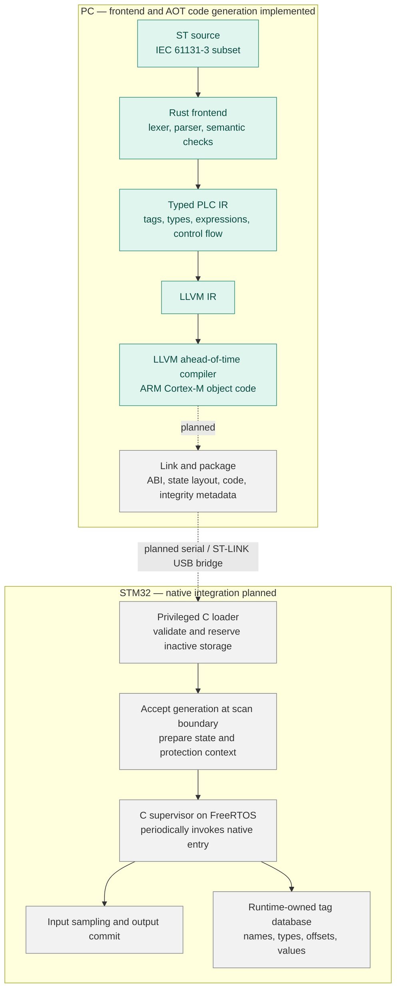
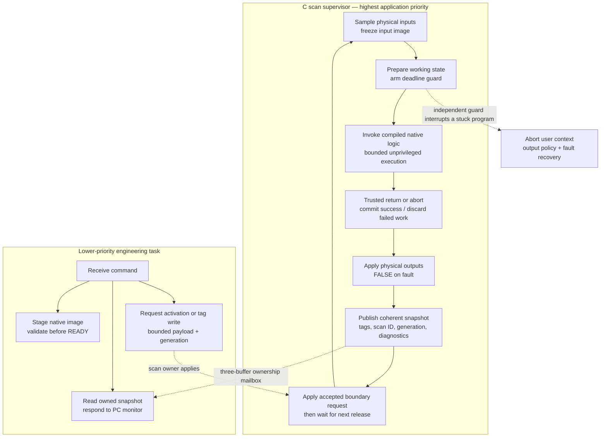

# tinyplc

A research PLC built around **Structured Text → Rust frontend → LLVM IR →
ahead-of-time machine code → a C runtime on FreeRTOS/STM32**. LLVM runs on the
PC. The microcontroller schedules and executes already-compiled user logic.
The initial target is the NUCLEO-F446RE.

**Education and research only. Do not use tinyplc for real machines or safety
functions.** Output fault handling is not a certified safety system.

Repository: [sergiogallegos/tinyplc](https://github.com/sergiogallegos/tinyplc).

## Current state: R1 Rust frontend and LLVM AOT

Implemented: a dependency-free Rust ST frontend, positioned diagnostics,
separate typed PLC IR, textual LLVM IR emission, exported tag metadata, and a
C-compatible scan entry point. Tests verify IR, execute host machine code at
`-O0` and `-O2`, compare results with independent historical interpreters, and
cross-compile to ARM Cortex-M object code.

**Not implemented yet:** a downloadable native image format, native loader,
RTOS execution of downloaded logic, MPU isolation, deadline abort, transport,
snapshot monitor, or native online migration/rollback. An ARM `.o` proves code
generation, not MCU execution. See the [R1 report](docs/R1-report.md).

The primary compiler is `compiler/` (Rust). Earlier Python/bytecode work is
retained only as a historical semantic test reference; it is not the product
architecture or a planned fallback execution mode.

## Try it on the PC

Use existing Rust/Cargo, LLVM (`clang`, `llvm-as`, `opt`), Python 3.11+, CMake,
and a C compiler. No packages are fetched by these commands.

```sh
make compiler
./target/debug/plcc examples/button_led.st -o /tmp/button_led.ll
make run
make aot-arm
make test
```

`make run` compiles the example through Rust and LLVM, links it with a C host
harness, and prints `R1 AOT scans=5 LED=1 N=2`. `make aot-arm` creates
`build/aot/button_led.arm.o`, an ARM relocatable object. It does not upload,
link firmware, or flash a board. [Compiler usage and ABI](compiler/README.md)
and [setup](docs/setup.md) give exact reproduction commands.

## How the system works

### 1. Compile on the PC; execute on the controller



Green is implemented host functionality; grey is planned integration. The C
runtime is firmware installed through ST-LINK. The user program is a separate
native artifact downloaded through the engineering connection. A general
Linux `.so` or an unqualified raw `.bin` is not our MCU loading contract.

### 2. Scan ownership and monitoring

**Planned target design.** The generated host scan function already implements
transactional values, but scheduling, physical I/O, protection, snapshots, and
fault latching still belong to the future supervisor.



Comms never reads a tag by racing a live write or retaining a pointer into a
reusable program slot. A snapshot contains values **and** names/types/scan and
generation identifiers. A slow monitor may miss scans without blocking the
producer. Tag writes are requests applied by the scan owner.

Native code addresses fields relative to a supplied state block. The symbol
metadata maps names to types/classes and offsets; it does not embed arbitrary
addresses in privileged runtime memory. Inputs are frozen and outputs are
proposals until commit. The initial research ABI uses one u32 cell per tag,
with byte offset `4 × declaration index`.

### 3. Edit, download, accept, observe

**Planned engineering workflow.** Download success and activation success are
separate states. The current R1 compiler stops before this workflow.

```mermaid
sequenceDiagram
  actor User as Engineer
  participant PC as Rust frontend + LLVM + engineering CLI
  participant Loader as C loader / comms
  participant Scan as FreeRTOS scan supervisor
  User->>PC: Edit ST and build target native image
  PC->>Loader: Transfer bounded chunks
  Loader->>Loader: Validate package, ABI, memory and imports
  Loader-->>PC: READY with candidate generation
  Note over Loader,Scan: Current program keeps running
  User->>PC: Accept edit
  PC->>Loader: ACTIVATE(candidate generation)
  Loader-->>PC: Request accepted; not yet running
  Loader->>Scan: Publish owned boundary request
  Scan->>Scan: Migrate permitted state and install native context
  Scan->>Scan: Execute first candidate scan under deadline guard
  alt Successful execution
    Scan-->>Loader: Snapshot confirms running generation
  else Contained application fault
    Scan->>Scan: Outputs FALSE; discard candidate working state
    Scan->>Scan: Restore reserved old context for next scan
    Scan-->>Loader: Fault and rejected generation retained
  end
  PC->>Loader: Read status and tag snapshot
  Loader-->>PC: Coherent values and actual execution state
  PC-->>User: Monitor tags and confirm edit outcome
```

Migration matches internal variable names and compatible types/layouts.
Inputs are resampled and outputs recomputed. Preserved variables do not
promise unchanged output behavior; rollback cannot undo physical actions.
Two slots cannot preserve active, previous, and another candidate at once.
Slot reservations and generation checks are required; a pending flag and
pointer flip alone are insufficient.

## Structured Text scope

The initial language is a small **IEC 61131-3-inspired ST subset**, not full
IEC conformance: BOOL/DINT, input/output/internal declarations, assignments,
IF/ELSIF/ELSE, arithmetic, comparisons, eager boolean logic, and comments.
See [language.md](docs/language.md) for exact grammar and limits.

```iecst
PROGRAM Main
VAR_INPUT BTN : BOOL; END_VAR
VAR_OUTPUT LED : BOOL; END_VAR
VAR n : DINT; END_VAR
IF BTN THEN n := n + 1; END_IF;
LED := NOT BTN;
END_PROGRAM
```

`N` increments on every scan with BTN pressed, not once per press. DINT wraps
modulo 2^32. Division by zero reports a fault; minimum DINT divided by -1 wraps.
The Rust emitter preserves these rules explicitly instead of relying on LLVM
undefined behavior. [LLVM division semantics](https://llvm.org/docs/LangRef.html#sdiv-instruction).

## Hardware

The NUCLEO-F446RE contains an STM32F446RE Cortex-M4F, an onboard ST-LINK/V2-1 debugger, a user LED, and a user button. Connect a USB **data** cable to ST-LINK CN1. No external I/O circuitry is needed for the first example. This board provides 3.3 V logic; industrial 24 V inputs and outputs would need separate conditioning and protection hardware.

| Resource | Project mapping | Verification and qualification |
| --- | --- | --- |
| LD2 green user LED | `LED` → PA5, HIGH lights it | UM1724 §7.6 and Table 19 |
| B1 user button | `BTN` → PC13, inverted for pressed = TRUE | UM1724 §7.7 confirms pin; polarity must match board schematic/revision before hardware acceptance |
| ST-LINK virtual COM port | USART2: PA2 TX, PA3 RX | UM1724 §7.10, default solder bridges SB13/SB14 connected |
| Serial configuration | 115200 baud, 8 data bits, no parity, 1 stop bit | Chosen firmware setting, not a fixed hardware setting |
| Memory | 512 KB flash, 128 KB main SRAM | STM32F446xC/E datasheet; also 4 KB backup SRAM, unused in v1 |
| Ethernet | No onboard Ethernet interface | Use UART on the board; host TCP transport is planned |

On macOS a VCP commonly appears as `/dev/tty.usbmodem*` and `/dev/cu.usbmodem*`; discover the actual path rather than hardcoding it. A detected device does not prove the firmware works. The hardware references are [ST UM1724 Rev 17](https://www.st.com/resource/en/user_manual/dm00105823.pdf), [STM32F446 datasheet](https://www.st.com/resource/en/datasheet/stm32f446re.pdf), and [MB1136 C04 schematic, MCU sheet](https://www.st.com.cn/resource/en/schematic_pack/mb1136-default-c04_schematic.pdf). The requested facts are consistent with these qualifications: baud and Mac device path are configuration/environment choices, and 128 KB excludes backup SRAM.

The Rust CLI currently uses built-in logical bindings for `BTN` (BOOL input)
and `LED` (BOOL output). The [board profile](boards/nucleo_f446re.json) records
the physical mapping; the future C board port applies it. The compiler library
also accepts an explicit list of logical bindings. No register access is emitted
into user logic.

See the [educational design and compiler/runtime studies](docs/education.md) for the reading
order, dependency boundary, and reasons for using a small STM32 board.

## Repository responsibilities

| Directory | Role |
| --- | --- |
| `compiler/` | Primary Rust lexer/parser, semantic analysis, typed PLC IR, LLVM emitter, CLI, scan ABI, tests |
| `sim/aot_main.c` | Current C harness invoking host AOT machine code |
| `port/` | Existing M0 blink; future native supervisor, GPIO/UART, MPU, deadline and fault handling |
| `tests/llvm/` | IR verification, optimized host AOT execution, ARM codegen and semantic comparisons |
| `boards/` | Target mapping information; native memory/ABI profiles remain to be defined |
| `core/`, `host/`, `tests/native/` | Historical M1/M2 implementation and independent test oracles |
| `docs/` | Current architecture, compiler contract, native loader roadmap, reports and historical designs |

The Rust frontend uses only its standard library. LLVM is a PC-side toolchain
dependency; no LLVM library or compiler runs on the MCU. FreeRTOS is the planned
scheduler dependency. The project owns PLC semantics, the native image/ABI
contract, engineering operations, and runtime state management.

## Roadmap after the architecture change

| Stage | Deliverable | Status |
| --- | --- | --- |
| M0–M2 | Initial board scaffold, C VM, Python compiler and independent execution tests | Historical; retained for evidence and test reuse |
| R1 | Rust ST frontend → typed PLC IR → LLVM IR; host AOT and Cortex-M object generation | Implemented and host-tested |
| R2 | Native ABI/package contract, C supervisor, bounded static native execution and fault containment on F446 | Planned |
| R3 | Native loader, upload protocol, engineering CLI and coherent tag monitoring | Planned |
| R4 | Online state migration, first-scan trial and explicit/automatic rollback | Planned |
| R5 | Larger language scope, source debugging, target ports and production-oriented assurance | Research extensions |

R1 replaces the earlier bytecode-first roadmap. No MCU loading, RTOS timing,
or hardware acceptance is implied by host tests. [Runtime architecture](docs/architecture.md)
explains ownership and recovery; [native roadmap](docs/native-roadmap.md)
compares the learning project with a production prototype and specifies target
acceptance gates. [M1](docs/M1-report.md) and [M2](docs/M2-report.md) remain dated
records, not current implementation instructions. Project code is MIT licensed.

## Acknowledgments and next tasks

The educational approach is inspired by Andrej Karpathy's micrograd and nanoGPT.
We study Rusty, OpenPLC Runtime and matiec for compiler/runtime design lessons.
tinyplc remains an independent implementation with its own small scope and
contracts. See [references and acknowledgments](docs/references.md) for credits,
official Rust/C/LLVM/FreeRTOS/STM32 documentation, and the attribution policy.

The [task checklist](docs/tasks.md) records completed work, acceptance evidence
and open decisions. R1 is complete; the next task is the R2 target ABI draft.
