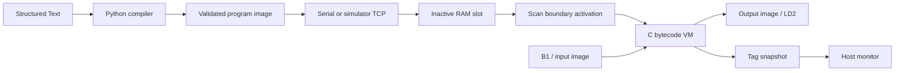

# tinyplc

A tiny PLC built from scratch to learn how hardware, a cyclic runtime, a bytecode virtual machine, and a Structured Text compiler fit together. The controller target is an STM32 NUCLEO-F446RE; a native macOS simulator will run the same portable C core so learning can continue without a board.

**Education and research only. Do not use tinyplc for real machines or safety functions.** Its output fault handling is a learning mechanism, not a certified safety system.

Repository: [sergiogallegos/tinyplc](https://github.com/sergiogallegos/tinyplc).

## Current state: M1 portable core

Implemented: portable C11 tag database, typed bytecode VM, CRC/image/control-flow validation, two RAM slots, deferred boundary activation, and transactional scan execution. The native simulator executes a hand-encoded version of the button/LED program. Native tests cover malformed images, arithmetic, stack/branch rules, faults, and concurrent activation handoffs. The compiler, protocol/TCP server, FreeRTOS, snapshots, state migration, and rollback remain later milestones.

Start on the Mac with an existing C compiler, CMake, and Make:

```sh
make sim
make run
make test
make sanitize
```

The executable finishes after five scheduled scans and prints `M1 scans=5 period_ms=10 LED=1 N=2 generation=1`. `make test` runs the simulator check and eight native test groups. `make sanitize` repeats them under address/undefined-behavior sanitizers; `make thread-sanitize` checks the producer/scan handoff with ThreadSanitizer. It does not load ST source or open a network socket yet. See [setup](docs/setup.md) for toolchain and board commands, and the [M1 report](docs/M1-report.md) for verified scope.

## What makes it a PLC?

A PLC repeatedly samples physical inputs, evaluates a user program, and updates physical outputs. The user program sees named variables, usually called **tags**, rather than GPIO registers. The input image freezes input values for one execution. The output image holds proposed output values until execution finishes. Internal tags retain state across scans, letting a program count, sequence, or remember previous values.

Our default scan period is 10 ms. Each scan reads B1 into `BTN`, executes bytecode from the beginning with a fresh operand stack, writes `LED` to LD2, then publishes a consistent tag snapshot. Internal `n` survives from scan to scan. A FreeRTOS task schedules these scans; the VM evaluates the user logic inside that task. FreeRTOS supplies scheduling, while our C code defines PLC semantics.



## Hardware

The NUCLEO-F446RE contains an STM32F446RE Cortex-M4F, an onboard ST-LINK/V2-1 debugger, a user LED, and a user button. Connect a USB **data** cable to ST-LINK CN1. No external I/O circuitry is needed for the first example. This board provides 3.3 V logic; industrial 24 V inputs and outputs would need separate conditioning and protection hardware.

| Resource | Project mapping | Verification and qualification |
| --- | --- | --- |
| LD2 green user LED | `LED` → PA5, HIGH lights it | UM1724 §7.6 and Table 19 |
| B1 user button | `BTN` → PC13, inverted for pressed = TRUE | UM1724 §7.7 confirms pin; polarity must match board schematic/revision before hardware acceptance |
| ST-LINK virtual COM port | USART2: PA2 TX, PA3 RX | UM1724 §7.10, default solder bridges SB13/SB14 connected |
| Serial configuration | 115200 baud, 8 data bits, no parity, 1 stop bit | Chosen firmware setting, not a fixed hardware setting |
| Memory | 512 KB flash, 128 KB main SRAM | STM32F446xC/E datasheet; also 4 KB backup SRAM, unused in v1 |
| Ethernet | No onboard Ethernet interface | Use UART on the board; TCP exists only in the host simulator |

On macOS a VCP commonly appears as `/dev/tty.usbmodem*` and `/dev/cu.usbmodem*`; discover the actual path rather than hardcoding it. A detected device does not prove the firmware works. The hardware references are [ST UM1724 Rev 17](https://www.st.com/resource/en/user_manual/dm00105823.pdf), [STM32F446 datasheet](https://www.st.com/resource/en/datasheet/stm32f446re.pdf), and [MB1136 C04 schematic, MCU sheet](https://www.st.com.cn/resource/en/schematic_pack/mb1136-default-c04_schematic.pdf). The requested facts are consistent with these qualifications: baud and Mac device path are configuration/environment choices, and 128 KB excludes backup SRAM.

The compiler will read [boards/nucleo_f446re.json](boards/nucleo_f446re.json). Only declared I/O names supported by that profile are accepted. The target port applies pin mapping and inversion; the portable VM has no knowledge of STM32 registers.

## Layers and construction order

| Directory | Responsibility |
| --- | --- |
| `core/` | Portable C11 tag database, image validator, VM, slot lifecycle, frame parser/encoder. No HAL, FreeRTOS, GPIO, or socket includes. |
| `port/` | STM32 GPIO/UART/DWT and FreeRTOS tasks. M0 contains a separate bare-metal blink. |
| `sim/` | Native scheduling and later TCP glue around `core/`, with simulated I/O. |
| `host/` | Python compiler, disassembler, reference VM, CLI, and tests. |
| `boards/` | Explicit hardware binding profiles. |
| `docs/` | [Architecture](docs/architecture.md), [bytecode](docs/bytecode.md), [protocol](docs/protocol.md), [assumptions](docs/ASSUMPTIONS.md), and [setup](docs/setup.md). |

We first prove the portable semantics on the Mac, then reuse them on the MCU. The C core uses fixed arrays and explicit capacities. Python uses a handwritten lexer and recursive-descent parser. We implement the VM and framing directly. The necessary external components are the toolchain, FreeRTOS-Kernel for scheduling, pytest for host tests, and optional pyserial for serial I/O; none are downloaded by the default build.

## From ST source to VM instructions

Our v1 language is a small IEC 61131-3 Structured Text subset, not a complete standards implementation. It supports `BOOL`, `DINT`, `VAR_INPUT`, `VAR_OUTPUT`, `VAR`, assignment, `IF/THEN/ELSIF/ELSE/END_IF`, and `(* comments *)`. Operators are `AND OR XOR NOT + - * / = <> < > <= >=`. No loops in v1 keeps compiler-generated control flow bounded.

```iecst
PROGRAM Main
VAR_INPUT BTN : BOOL; END_VAR
VAR_OUTPUT LED : BOOL; END_VAR
VAR n : DINT; END_VAR
IF BTN THEN n := n + 1; END_IF;
LED := NOT BTN;
END_PROGRAM
```

Here `n` increments **on every scan while the button is pressed**, about 100 times per second at 10 ms, rather than once per button press. `LED` is on while the button is released. The source is in [examples/button_led.st](examples/button_led.st).

The compiler tokenizes the text with line/column positions, parses it into an AST, resolves declarations, checks types and I/O bindings, then emits instructions. A symbol table maps `BTN`, `LED`, and `N` to numeric tag indices. Bytecode carries those indices; names remain in the image metadata for monitoring and state migration.

For `n := n + 1`, the compiler emits conceptually:

```text
LOAD N         stack: [old_n]
PUSH_CONST 1   stack: [old_n, 1]
ADD            stack: [old_n + 1]
STORE N        stack: []   tag N now holds the result
```

The VM is a C interpreter with a program counter, a fixed operand stack, a tag array, and an instruction budget. It decodes an opcode, validates/accesses its operands, performs the operation, advances or jumps, and repeats until `HALT`. A conditional compiles to an expression followed by `JZ`, which consumes the condition and skips the THEN block when FALSE. `HALT` ends the current scan's program execution; the next scan starts at instruction zero. Bytecode is data interpreted by C, rather than native ARM instructions.

`DINT` wraps as 32-bit two's-complement arithmetic. C implementation must use unsigned operations to avoid signed-overflow undefined behavior. Division by zero faults. BOOL values remain 0/1. The image validator checks CRC, tag indices, instruction boundaries, forward jump targets, types, and stack depth before activation. The running VM independently enforces capacity and instruction limits. [bytecode.md](docs/bytecode.md) specifies the proposed binary contract.

## Scheduling, faults, and online edits

M1 implements the scan-owner API, fault latching, zero-initialized activation at a boundary, and bounded comms/scan slot handoff. A successful scan commits internal values; a failed scan discards partial internal assignments and clears output tags. The caller applies those tags to physical outputs. See [core API guide](core/README.md) for ownership rules. The FreeRTOS, snapshot, migration, and rollback behavior described next is the remaining v1 design.

The planned FreeRTOS configuration uses its ARM_CM4F port, a 1 kHz tick, static task/queue allocation, assertions, and stack overflow checks. The highest application priority scan task uses `vTaskDelayUntil`; the lower priority comms task receives bytes and stages downloads. No allocation or UART waiting occurs in the scan path. DWT measures execution cycles, actual scan intervals, jitter extrema, and overruns. Host timing does not substitute for DWT measurements.

Downloads fill the inactive RAM slot. `ACTIVATE` validates it and requests a swap. After the current scan writes outputs, the scan owner migrates internal VAR values with matching names and types and publishes the new active pointer atomically. New or changed variables start at zero. The next scan reads inputs and runs the new program. The old image remains available for rollback; a failed first scan triggers automatic rollback. Slot ownership prevents downloading over either active code or the preserved rollback image.

On a VM fault or scan overrun, the target forces all output pins FALSE, records a fault, and leaves communications alive. Publishing tags uses a bounded snapshot mechanism with explicit buffer ownership so a slow monitor cannot hold up the scan. Detailed ownership and recovery decisions are in [architecture.md](docs/architecture.md).

## Planned host workflow

M2 introduces `plcc`; M3 introduces `plctool`. The intended workflow is compile/download → activate → monitor → edit/download → activate → optionally rollback. Transports will accept a serial device path or `tcp://127.0.0.1:6432`. `plctool` will expose `info`, `download <file.st>`, `activate`, `rollback`, `read`, `write`, `status`, and `monitor`; monitor refreshes near 10 Hz. Writes are limited to internal VARs and applied by the scan task.

Native C unit tests, Python compiler golden tests, protocol round trips, and randomized differential tests will make the construction observable. Differential tests compare a Python bytecode interpreter with the actual C VM for the same programs and inputs, including overflow and fault cases. Hardware acceptance is reported separately with exact commands and observed outputs.

## Milestones

| Milestone | Deliverable | State |
| --- | --- | --- |
| M0 | Scaffold, documentation, toolchain choice, `make sim`, LD2 blink | Host scaffold ready; target build/hardware verification pending tools |
| M1 | Tag DB, VM, image validator, slot ownership/boundary API, native unit tests | Verified on host |
| M2 | Compiler, disassembler, reference interpreter, differential tests | Planned |
| M3 | Protocol, TCP simulator, basic safe activation/snapshots, CLI end to end | Planned |
| M4 | FreeRTOS scan task, GPIO/UART, real button/LED ST program | Planned |
| M5 | Live swap, state migration, rollback, DWT statistics in monitor | Planned |
| M6 | TON, Modbus RTU, flash persistence, CI | Stretch |

Each milestone has a conventional commit group and a report stating host versus hardware evidence, remaining work, and reproduction commands. Project code is [MIT licensed](LICENSE).
