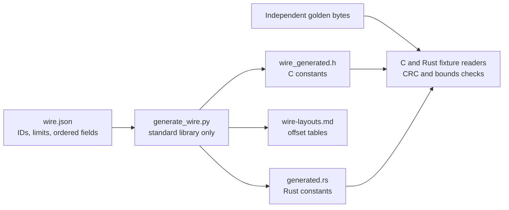

# Shared native wire contract

`wire.json` is the source for package/frame/descriptor layouts, numeric IDs and
limits. Fields have explicit widths; offsets and fixed sizes are derived in
order. This describes tinyPLC's original native lab profile, not IEC wire
compatibility or another PLC vendor's format.

Run `make wire-generate` after an intentional contract edit. `make test-wire`
checks generated files without rewriting them, then compiles independent C and
Rust fixture consumers. The normative rules live in
[wire-format.md](../docs/wire-format.md); generation cannot express every
ownership, retry or compatibility rule.

The Rust crate is `no_std` with no dependencies. `wire.h` offers matching C11
byte readers, bounded ranges and CRC primitives. Neither implementation casts
wire bytes to structs or allocates memory. Python uses only its standard
library for generation/tests; it is not the compiler, packager or runtime.

This directory supplies primitives, not a package or streaming parser.
[The R3.2 implementation](../docs/native-loader.md) now validates complete
packages and stages them transactionally; [plcpack](../packager/README.md)
encodes them. Test-only wire consumers still check only the envelope.
Board transport/activation remain pending. The full package can exceed the executable slot size; metadata
must have separately budgeted storage.
