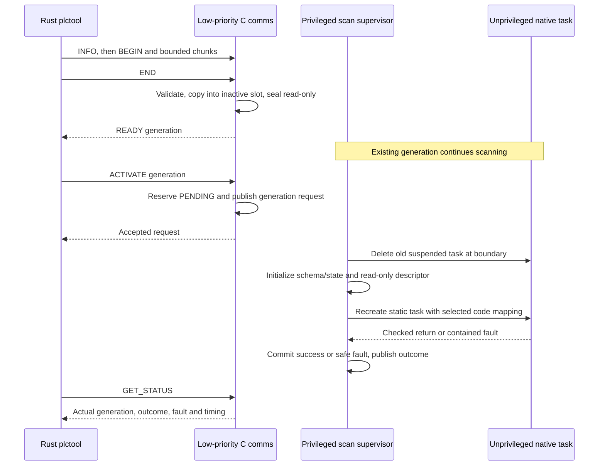

# Engineering transport, native activation and monitoring

The STM32 now accepts native packages over its ST-LINK USB serial bridge.
Rust `plctool` implements INFO, GET_STATUS, DOWNLOAD_BEGIN/CHUNK/END, ACTIVATE
and READ_TAGS (`monitor`). R4 adds ROLLBACK and GET_UPDATE_STATUS. The firmware
advertises command mask `0x37f` and capability mask `0x7` (unsigned lab,
migration, rollback). WRITE_TAG remains UNSUPPORTED. R3.4 adds
[owned tag snapshots](R3.4-report.md); R4 implements the
[online state contract](online-state.md).

## Task and interrupt ownership

| Owner | Priority | Work |
| --- | --- | --- |
| Privileged scan task | 3 | Sample inputs, supervise native execution, commit outputs, apply activation |
| Unprivileged native worker | 2 | Execute only the active RAM slot against ABI 2 input/working images |
| Privileged comms task | 1 | Parse requests, validate/stage, transmit responses, queue generation requests |
| Idle | 0 | Kernel idle work |
| TIM2 interrupt | NVIC 5 | Native deadline and deferred completion |
| USART2 interrupt | NVIC 6 | Receive bytes/timestamps only; no parsing or loader operations |

USART2 uses PA2/PA3 AF7, 115200 8N1, APB1 at the existing 16 MHz HSI clock.
This first driver uses byte interrupts rather than DMA to keep the hardware
implementation small and directly inspectable. A fixed 1,024-entry ring stores
one byte and one millisecond arrival timestamp per entry (5 KiB total). Arrival
time preserves the 100 ms inter-byte rule even if the comms task drains later.
Producer/consumer indices and explicit memory barriers publish and retire ring
cells. USART errors or ring overflow discard ambiguous buffered input and
increment a debugger-visible counter; they do not alter active logic.

The comms task polls at one tick and drains at most one ring's worth of bytes
per iteration. Transmit waits are low-priority and preemptible, with a bounded
one-second guard. No receive ISR performs CRC, parsing, copying or task control.
A parser holds at most 262 bytes, drops CRC-bad frames, and replays the remaining
bounded bytes after rejection to preserve an embedded start. Stream expiry and
transfer expiry are separate. See [wire rules](wire-format.md).

## A code slot becomes writable only for validation/copy

Normal comms mapping makes both code slots read-only and non-executable.
During END, only the owned inactive slot receives a privileged writable/XN
overlay. The adapter updates the FreeRTOS MPU settings and yields so PendSV
installs them before touching code. It seals both slots on every END outcome.
Active code stays read-only; the native worker maps only its own active slot RX,
frozen inputs read-only/XN and working state read/write/XN. Its stack is separate.
The scan task maps both code slots read-only/XN and never directly calls native
code in its own privileged context.

Parsing, CRCs and payload copies never run inside a critical section. Short
critical sections cover request publication and small coherent status/slot
field copies. Thus comms can add bounded interrupt/scheduling latency, but never
holds a mutex needed by the scan or masks interrupts for a whole transfer.
These short sections and byte interrupts still require measurement; “low
priority” alone is not a zero-jitter guarantee.



The worker is suspended after every native completion/fault. At the next scan
boundary the supervisor can delete that non-running task and recreate it using
the same statically allocated TCB/stack. This restores register/stack context,
including after a parked fault. There is no allocator or self-deletion/idle-free
race. The descriptor at `0x20018100` supplies entry, count and generation; the
immutable flash gateway reads it before each invocation. Counts 1..64 are
supported, and physical bindings derive from the validated tag table rather
than fixed BTN/LED indices. Unbound physical outputs remain FALSE.

Healthy activation migrates internal VARs by exact name/type and captures a
checkpoint. The previous image remains reserved through the candidate trial,
including the scheduler release check. A contained first-scan failure discards
working state and restores that checkpoint at a later release. Explicit rollback
restores the same saved state and consumes PREVIOUS. A failed restoration stays
faulted and never starts a retry loop. Faulted-source activation cold-starts the
candidate with no fallback checkpoint. Invalid exception contexts still take
the watchdog reset path and lose all RAM reservations. See the
[R4 implementation and ownership tests](R4.2-report.md).

## Host workflow

Use one host at a time. Build for the inactive base reported by INFO; the CLI
checks placement before reserving and checks the actual returned reservation.
State IDs: EMPTY=0, ACTIVE=1, RECEIVING=2, READY=3, PENDING=4, PREVIOUS=5.

```sh
./target/debug/plctool /dev/cu.usbmodem2103 info
./target/debug/plcpack examples/download_led_off.st --slot B -o build/edit-b.tplc \
  --clang /path/to/clang --ld /path/to/arm-none-eabi-ld
./target/debug/plctool /dev/cu.usbmodem2103 download build/edit-b.tplc
./target/debug/plctool /dev/cu.usbmodem2103 status
# Use the generation printed by download, not a hard-coded persistent ID.
./target/debug/plctool /dev/cu.usbmodem2103 activate 2
```

The CLI uses Rust std and the OS `stty` utility, not a serial crate. macOS is
hardware-tested; the Linux `stty -F` path is present but not hardware-qualified.
It holds the device open while applying raw settings, since macOS may restore
tty defaults on last close. Reads use VMIN=0/VTIME=1 and an overall response
deadline. Settings are restored on normal return. Use `/dev/cu.*` on this Mac;
Windows serial support is not implemented.

Only a timed-out CHUNK is retried automatically (same ID, offset and bytes, at
most three attempts). Delayed ACKs must match its expected next offset. BEGIN,
END and ACTIVATE timeouts leave outcomes uncertain: inspect INFO/GET_STATUS,
rather than blindly repeating a mutation. ACTIVATE polls for a terminal outcome
and returns failure for a fault/rejection. JSON status contains scan count,
actual generation, pending/requested generation, fault, scan times in µs,
signed release jitter and cumulative misses. It is not a live tag monitor.

`TINYPLC_ALLOW_UNSIGNED_LAB=1` in the lab firmware configuration explicitly
allows unsigned images. Disabling it prevents BEGIN; packages cannot enable it.
CRC is corruption detection, not authentication or replay protection. Reset
invalidates session handles. No TCP listener, signature system or remote-access
security is provided.

## Verification and references

`make test-engineering` tests stream fragmentation, embedded-frame recovery,
expiry, request validation and a real Rust CLI round trip through a POSIX PTY,
including a dropped chunk acknowledgement. The explicit
`scripts/test_engineering_board.py` flashes and tests a lab board, then restores
normal firmware in `finally`; it is never part of `make test`.

The [R3.3 report](R3.3-report.md) records hardware evidence, memory budgets and
limitations. Register and wiring references are ST's
[RM0390 reference manual](https://www.st.com/resource/en/reference_manual/rm0390-stm32f446xx-advanced-armbased-32bit-mcus-stmicroelectronics.pdf)
and [UM1724 Nucleo-64 manual](https://www.st.com/resource/en/user_manual/DM00105823-.pdf).
Task/MPU integration follows the pinned FreeRTOS implementation described in
[target-toolchain.md](target-toolchain.md). All code here is project-owned;
related-work acknowledgments remain in [references.md](references.md).
