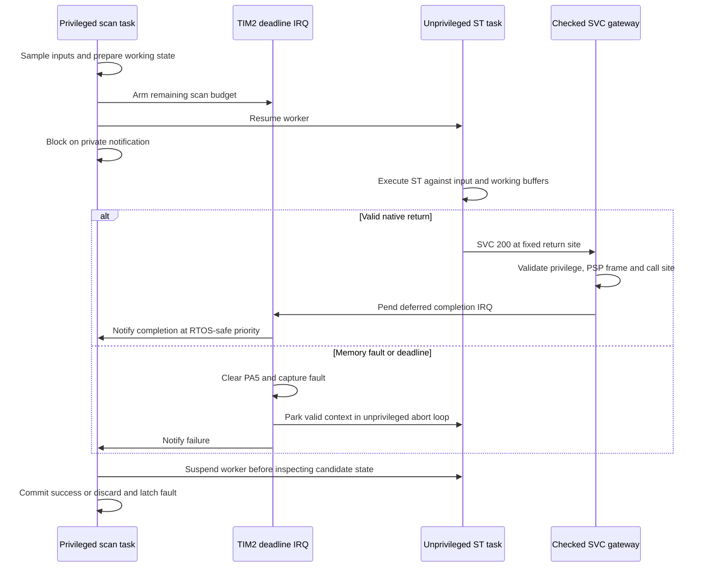

# Native execution boundary: R2.6–R3.3

The supervisor and ST program now run in **different static FreeRTOS tasks**.
The supervisor remains privileged and owns committed values, GPIO, fault state,
TIM2 and IWDG. The ST worker is unprivileged and has a separate 2 KiB stack.
The portable C scan transaction remains unchanged: its entry callback now
waits for the isolated worker instead of directly calling user code.

The boot example is firmware-linked into A. [R3.3](engineering-transport.md)
adds downloaded fixed-slot packages, 1..64 tags and boundary worker recreation.
The gateway reads the supervisor-owned descriptor instead of a fixed entry/count.
ABI 2 argument/return types are unchanged; no runtime service imports are exposed.
R2.7 places the immutable return/abort gateway in firmware flash, outside both
program slots. See [package ownership](native-package.md) and the [R2 report](R2-report.md).



For memory faults, the CPU fault handler performs the clear/park operations,
then pends TIM2 to notify the supervisor. If the context cannot safely return,
that path instead clears PA5 and waits for independent watchdog reset.

## Memory and privilege

The existing MPU layout maps user code/constants read-only and executable,
inputs read-only and non-executable, working state read/write and
non-executable, and the worker stack read/write and non-executable. Supervisor
flash, privileged RAM, peripheral registers and the inactive code slot are
inaccessible to the worker. The supervisor stack now lives in privileged RAM.
The FreeRTOS port's peripheral mapping retains the reviewed privileged-only
permission patch. [Memory map](memory-layout.md).

The port restores each task's CONTROL and MPU state on context switch. User
code never runs on the supervisor's stack. FP operations are excluded by the
ABI; after scheduler startup the supervisor sets CP10/11 access to privileged
only. A user FP instruction raises NOCP. This avoids accepting extended FP
exception frames in the small gateway.

## Checked return and abort

[The assembly veneer](../port/nucleo_f446re/native/gateway.S) routes privileged
SVC calls to FreeRTOS (needed to start the scheduler). Every unprivileged SVC
instead reaches the project-owned checker. It accepts only SVC 200's fixed,
immutable return site; direct kernel services and forged return sites fault.
The user receives no task handle and cannot invoke notification APIs.

Before dereferencing a saved frame, the checker requires an aligned frame in
the worker stack, room for the basic frame plus alignment padding, a basic
thread/PSP EXC_RETURN, unprivileged CONTROL without FPCA, and a Thumb thread-mode
xPSR. CONTROL.SPSEL reads zero in Handler mode: PSP provenance comes from
EXC_RETURN, not that bit. Host tests exercise the boundary predicates; board
tests exercise actual exceptions.

SVC runs above the kernel's interrupt API ceiling, so it cannot notify a task
directly. It writes protected completion state and pends TIM2, whose IRQ priority
is the configured FreeRTOS API ceiling (5). TIM2 performs the FromISR notification
and requests the normal PendSV switch. The higher-priority supervisor suspends
the worker before checking or committing working state. No user stack address
is used as a supervisor return address, service pointer or callback argument.

On contained faults, the saved PC is changed to an immutable unprivileged park
loop. That worker is suspended and never resumed while the fault is latched.
An invalid frame, stacking/unstacking fault, or fault outside the expected user
job takes the reset fallback. It never tries to restore or context-switch an
untrusted stack. Reset fallback reads hardware CFSR itself, because a stacking
fault can be pending when the higher-priority SVC checker rejects the frame. The existing RTOS vector self-check is disabled because SVC
is intentionally routed; `target-verify` checks the replacement SVC, fault,
timer, PendSV and SysTick vectors instead.

## Deadline and watchdog policy

TIM2 runs from the 16 MHz APB1 clock with prescaler zero. The supervisor arms a
one-shot counter for the remaining nominal 160,000-cycle scan budget. Its
update event must become visible before clearing UIF and enabling the IRQ;
otherwise initialization can be mistaken for expiration. Native return also
checks elapsed DWT time and pending UIF before accepting completion.

The IRQ stops the timer, clears PA5, parks a valid user context and wakes the
supervisor. This works even if the program never returns or executes an
unprivileged `cpsid i`. RTOS critical sections can briefly defer this IRQ; timer
setup and interrupt latency also add delay. Measurements quantify the tested
path, not a proof that the output changes at precisely 10.000 ms. The timer is disarmed at native completion; a hang in later trusted supervisor
work relies on watchdog fallback. The portable transaction still checks elapsed time before and after its physical output
commit. A missed release is latched, with no catch-up execution burst.

IWDG uses the independent LSI clock, /64 prescaling and reload 249: about 0.5 s
at nominal 32 kHz, subject to oscillator tolerance. Only the privileged scan
supervisor feeds it. It feeds after a healthy supervision cycle **including a
latched-fault cycle that holds outputs safe**, rather than resetting repeatedly
just because user logic is faulted. This is a deliberate refinement of the
original “feed only after successful user logic” proposal. Hung supervision or
a fatal-context handler stops feeding and resets the chip.

On IWDG reset, boot latches fault 261 and does not execute user code. A small
privileged NOLOAD record preserves optional exception diagnostics across that
reset; hardware reset cause plus magic/complement validation gate its use.
It is not durable state or a security credential. VAR state resets to zero.
An explicit board reset clears this experimental latch. R3.3 also permits an
explicit ACTIVATE of a freshly validated program: the supervisor reconstructs
the worker and cold-initializes state. Serial INFO/GET_STATUS remain available
in a healthy latched-fault supervisor; there is no standalone clear-fault command.

## Evidence and boundaries

[Hardware report](R2.6-report.md) records legal execution, denied accesses,
checked services, deadline faults and watchdog fallback. Build-only preparation:

```sh
make compiler
make test
python3 scripts/prepare_isolation_tests.py \
  --kernel-archive /tmp/tinyplc-kernel.tar.gz \
  --gcc-prefix /tmp/tinyplc-arm-gcc/bin/arm-none-eabi-
```

Explicit hardware test, replacing firmware with the prepared fixtures:

```sh
/tmp/tinyplc-openocd/bin/openocd -f interface/stlink.cfg \
  -f target/stm32f4x.cfg -f build/isolation/run.tcl
```

The matrix checks identity, verifies every programmed image, observes an ON
output before each injected fault, then checks fault state, discarded candidate
values and PA5 off. Its cleanup restores the normal ST firmware on assertion
failure as well as success; a disconnected probe/power failure can still prevent
cleanup. Manifest hashes identify the exact images. OpenOCD freezes watchdogs
while halted; reset tests allow the target to run, and all debug halts affect
observations. These are research tests, not an adversarial proof, WCET analysis
or industrial safety qualification. No downloader or concurrent tag monitor is
included; those are R3.

## Sources and credits

The gateway, frame checker and STM32 guard are original tinyplc code. They use
the pinned FreeRTOS port, with its upstream license preserved in the build.
Related PLC projects remain credited in [references](references.md).

- [FreeRTOS pinned Cortex-M4 MPU port](https://github.com/FreeRTOS/FreeRTOS-Kernel/tree/3a22924e0a9ddbbc8b0758881c33b3422a5cc20d/portable/GCC/ARM_CM4_MPU): task context, MPU programming and SVC behavior.
- [ST PM0214](https://www.st.com/resource/en/programming_manual/pm0214-stm32-cortexm4-mcus-and-mpus-programming-manual-stmicroelectronics.pdf): CONTROL, exception frames, fault status, MPU and NVIC semantics.
- [ST RM0390](https://www.st.com/resource/en/reference_manual/rm0390-stm32f446xx-advanced-armbased-32bit-mcus-stmicroelectronics.pdf): TIM2, GPIO, reset-cause and IWDG registers.
