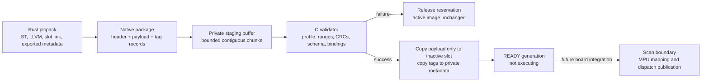

# R3.2 native package validation and staging

Implemented in portable C, tested on the host and cross-built for Cortex-M4.
[R3.3](engineering-transport.md) now integrates UART reception, MPU-aware
staging, descriptor publication and boundary activation on the board.
This page describes the portable staging layer, which by itself never executes code.

## Ownership and memory

`tinyplc_loader` owns one 19,024-byte package buffer and two bounded metadata
records, including a 2,560-byte tag table per slot. Code storage is supplied as
two separate, disjoint 16 KiB buffers. On the board these will correspond to
A/B, but host tests use ordinary arrays. No received integer is cast to a
pointer, and there is no allocation in the C validator or loader.



The validator returns a borrowed view only on success. Its caller must keep
the input stable until copying completes. The staging loader provides that
ownership itself: one serialized owner handles every operation, including
expiry. It must not run concurrently with mutation of its slots or buffer.
The future comms/scan adapter needs an owned boundary request, not unsynchronized
access to this struct. All API output pointers must be valid and disjoint from
loader/input storage; chunk input must remain valid for its declared count.

The initial active-slot argument protects an existing firmware-linked module
as generation 1; its schema is deliberately unavailable through this API.
Alternatively `-1` starts with empty slots. Initializing is a boot operation,
not a way to reset counters in an existing session.

## Transfer state machine

BEGIN validates total size, unsigned-lab policy, slot availability and counter
capacity. It reserves an EMPTY slot preferentially, otherwise an inactive READY
or PREVIOUS slot. A new reservation explicitly retires that candidate/rollback
image and its generation. ACTIVE slots are never selected; any PENDING slot
blocks BEGIN. This clarifies the R3.1 ownership rule: READY is immutable until
explicitly retired by a new BEGIN, not permanently reserved forever.

CHUNK requires the live transfer ID and the next contiguous package offset.
Bounds are checked before copying. Only an exact duplicate of the latest
accepted chunk receives an idempotent success. Conflicting bytes, stale IDs,
older duplicates and out-of-order offsets leave transfer data/progress unchanged.
An accepted chunk, including that exact duplicate, refreshes the 30-second
inactivity timeout. Invalid requests do not refresh it. A timed-out reservation
is discarded before processing the next operation.

END requires the declared byte count. Incomplete END leaves the transfer open;
failed complete validation releases it. Only successful validation touches
inactive code storage: it clears that slot, copies the payload, copies validated
tags into private metadata, and publishes a nonzero READY generation. Header
and tag bytes never spill into the code slot. Active code and its generation
remain unchanged on success or failure. END success is not activation.

IDs/generations never reuse zero or wrap to a previous value during one boot.
Exhaustion returns BUSY until a fresh boot/session. Expiry uses a monotonic
modulo-u32 millisecond clock; the owner must service it at least once within
2^31 ms. The API has no timer interrupt or implicit background worker.

## Validation boundary

`tinyplc_package_validate` enforces every v1 header identity/resource/placement
field, exact section adjacency/total, text/Thumb entry bounds, reserved zeros,
whole-package and schema CRCs, canonical unique names, valid type/class and
board bindings, and unique physical binding ownership. It rejects unsigned
images unless the caller's firmware policy permits them. Its output remains
unchanged on failure. The numeric rules come from the generated contract.

A structurally valid header with a bad package CRC returns CRC_ERROR. Other
incompatible/malformed images return INVALID_IMAGE. Header/range checks precede
CRC, so a damaged header can produce INVALID_IMAGE even if its CRC is also bad.
These checks do not disassemble native instructions or prove stack bounds,
termination, code/schema agreement or authenticity. Trusted compiler/link checks,
MPU/privilege enforcement and the deadline/watchdog boundary remain required.

## Measured cross-build budget

With the pinned GCC 13.3.1, the standalone ARM relocatable combination uses
2,512 bytes of text, no initialized data, and 24,240 bytes of static loader
storage. A compile-time assertion caps that storage at 24 KiB. Host pointer
width makes the same state 24,248 bytes on this Mac. Code-slot reservations
are separate and unchanged.

The largest compiler-reported individual stack frames are 80 bytes for
validation and END. These are per-function static frame estimates, not a
measured full task stack or interrupt nesting budget. The standalone link has
no undefined symbols: project-owned memcpy/memset/memcmp/memmove supply its
standard byte operations. See [target evidence](evidence/R3.2-loader-target.json).

Compared with the R2.7 privileged RAM section total (10,508 bytes), adding this
loader and retaining the separate 4 KiB MSP reservation would leave about
26 KiB inside the 64 KiB privileged region. This is a planning estimate;
comms/snapshot stacks and metadata still need an integrated linker report.
Validation/copy work must run preemptibly at low priority; no whole-package
CRC or copy may be placed inside a scan-blocking critical section.

## Reproduce

```sh
make test ARM_PREFIX=/path/to/bin/arm-none-eabi-
make loader-target-check ARM_PREFIX=/path/to/bin/arm-none-eabi-
```

`test-loader` can run the focused host suite. It includes actual Rust packages
for both slots, maximum-size staging, malformed images, 4,000 deterministic
mutations per ordinary staging fixture, timeout/retry/exhaustion tests and
active-code preservation under ASan/UBSan. No command in this page flashes or
executes the staged native bytes.
