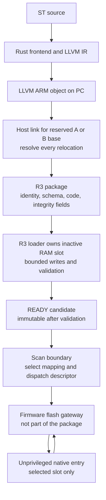

# R2.7 native package requirements: fixed-slot lab profile

These decisions close the R2 architecture gate. They specify the first package
profile and ownership rules for R3. The Rust encoder and portable C validator/staging are implemented in
[R3.2](R3.2-report.md); [R3.3](R3.3-report.md) adds board download/activation. [R3.1 now freezes](wire-format.md) byte offsets, numeric IDs, CRC coverage and
golden fixtures in one shared contract.
The linked ELF and raw payloads produced by the placement test are build
artifacts, not packages accepted by the controller.

## Placement decision

Use **host-linked, fixed-slot code with no on-device relocations or imports**.
The host targets either A (`0x20010000`) or B (`0x20014000`), each 16 KiB. The
MCU must reject an image whose declared link base differs from its reserved
inactive slot. It never guesses whether bytes are position independent and
never copies an A-linked image into B. Both variants can be built in advance.

LLVM still emits a relocatable ARM object on the PC. The host linker resolves
all local code/data references for the selected slot, including absolute
references. The MCU receives a flat read-only code/constants payload inside a
versioned package, not ELF relocations, a Linux shared object, or LLVM IR.
Internal functions and constants are allowed; unresolved imports, writable
native globals, TLS, constructors, destructors and native allocation are not.
User state stays in the ABI 2 runtime-owned arrays.

Why this first: it removes relocation parsing and arbitrary address patching
from the MCU while preserving A/B staging. The cost is two possible linked
variants and a host/runtime slot agreement. Position-independent code or a
restricted relocator would be a different negotiated profile with its own
fixtures and failure tests, not a silent extension of this one.

The standalone [link script](../port/nucleo_f446re/native/program.ld) and
[placement verifier](../scripts/verify_placement.py) establish this host-side
choice. They link the ST object independently for both slots, reject imports,
writable state, overflow and firmware addresses, and test that a real absolute
self-reference is fixed differently for A and B. The verifier audits the linked
ELF for remaining relocations and allocated bytes outside the selected slot.
This is a trusted-build check, not an untrusted-ELF parser on the MCU.

## Firmware owns the gateway

The worker loop, checked-return SVC site and abort loop now live in the
firmware-owned 4 KiB user-readable flash window at `0x08010000`. The gateway is
separate from the FreeRTOS veneer section and remains read-only/executable.
Neither RAM slot contains firmware code; the earlier standalone RAM probe was
retired because actual ST execution now proves RAM instruction fetch.

The boot program is linked statically; downloaded modules can have 1..64 tags.
The supervisor publishes its validated entry/count/generation through
a **supervisor-written, user-read-only dispatch descriptor**, using reserved
space after the 64 input cells in the existing 512-byte input region. The
firmware gateway reads that descriptor; the package cannot replace the gateway,
choose a privileged service pointer, supply a return PC, or set MPU registers.
The descriptor's precise layout and golden checks are defined by [R3.1](wire-format.md). No runtime
imports are exposed by the first profile.

At activation, with the worker suspended, the supervisor updates the worker's
code MPU mapping and dispatch descriptor together. A loader context must map
its owned staging slot writable/non-executable; that slot is inaccessible to
the worker. Active code is immutable. FreeRTOS task-specific MPU mappings must
preserve these rules across every context, including the comms task.
Portable staging/validation and task-specific MPU mapping/activation are
implemented; see [R3.3 ownership and evidence](engineering-transport.md).

## Required package information and rejection rules

All serialized integers will have explicit little-endian widths; no C struct
layout, host pointers or packed compiler enums are serialized. The following are required logical fields; [wire-layouts.md](wire-layouts.md)
now defines their exact byte offsets.

| Group | Required meaning and validation |
| --- | --- |
| Identity | Magic, package-format version, header length, total length and native-image kind. Reject legacy bytecode and unknown mandatory features. |
| Target | F446 lab profile, ARMv7E-M Thumb/little-endian/base AAPCS soft-float contract, native call ABI 2 and compatible runtime-contract revision. ISA compatibility is not implied merely by “ARM.” |
| Placement | Exact slot link base, bounded payload length, executable-text extent and even entry offset. The runtime derives the Thumb pointer from base + offset; the entry must lie inside the declared text extent, never firmware or a metadata-only region. |
| Resources | 1..64 tag cells, exactly four bytes per cell in each logical state view, and the fixed 2 KiB worker-stack profile. No arbitrary data/BSS addresses or additional memory regions. A stack-budget field is a policy request, not a proof of usage. |
| Schema | Canonical tag records in declaration/index order: unique uppercase names (31 bytes maximum plus NUL), BOOL/DINT type, INPUT/OUTPUT/VAR class and declared board binding. Cell offset is derived as index × 4. |
| Integrity | Whole-package CRC32 with its own field zeroed during calculation, plus a schema fingerprint. Canonical serialization and coverage are frozen in R3.1. Full schema comparison remains necessary despite matching fingerprints. |
| Authenticity | Explicit `unsigned_lab` policy identifier, no signature in the first profile. Header length/version and reserved fields allow a later authenticated profile; unsupported policy IDs must be rejected. |
| Sections | Bounded text/constants and canonical tag table, with exact lengths, no overlapping ranges, unknown sections, trailing unaccounted bytes, imports or runtime relocation records. |

CRC32 uses the existing project's CRC-32/ISO-HDLC convention (reflected
polynomial `0xEDB88320`, initial/final XOR `0xFFFFFFFF`, check value
`0xCBF43926` for `123456789`). CRC identifies corruption, **not the author or
safety of native code**. Artifact SHA-256 values in research evidence identify
what was tested; they are not an implemented download authentication scheme.

The packager derives the canonical tag table from the compiler's exported
metadata, rather than accepting an unrelated hand-edited symbol database.
The loader validates its bounds, names, types, classes and board bindings.
This does not prove that native instructions implement the schema correctly;
compiler/packager tests, fault containment and the lab trust model still matter.
Initial values are zero. No user pointer values or nonzero initializers are
introduced by this profile.

The F446 board bindings initially expose BTN/PC13 (inverted BOOL input) and
LED/PA5 (BOOL output, safe value FALSE). Binding IDs are explicit contract
constants, not host-supplied peripheral addresses. Reject unsupported pins,
wrong types/classes and duplicate physical-output ownership. VAR tags have no
physical binding. R3.3 generalizes the boot example to validated 1..64-tag schemas, including
reordered bindings and a 64-tag hardware test.

## Transfer, activation and rollback ownership

1. INFO reports profile/ABI/package capabilities, permitted slot bases and
   capacities, stack/data budgets, slot ownership and the `unsigned_lab` policy.
2. DOWNLOAD_BEGIN reserves one inactive slot and returns its base, capacity and
   a transfer ID. The host links for that base or selects its matching cached
   variant. A reservation has an explicit expiry; stale chunks are rejected.
3. Chunks target the reserved package offset only. The MCU never interprets a
   chunk offset as an absolute memory address. Retries and duplicate rules are
   defined by the engineering protocol; bounds checks precede writes.
4. DOWNLOAD_END validates the complete package before READY. Malformed,
   incompatible, partial or wrong-slot packages cannot affect active code,
   committed values or the dispatch descriptor. READY storage is immutable.
5. ACTIVATE names the validated candidate generation. Acceptance queues a
   request; actual execution changes only at a scan boundary, with worker
   quiescence, mapping/descriptor consistency and an observable completion ID.

The package does not choose transfer IDs or runtime generation counters. After
an uncertain timeout, the host reconciles slot/status ownership instead of
blindly retrying activation. Starting a new download into the old slot retires
that slot's rollback availability, which INFO must expose.

Fixed placement means rollback runs the old image **in its original slot**;
there is no relocation back into a “current” address. State mapping, trial-scan
failure and faulted-worker reconstruction remain R4. A schema fingerprint is
not permission to perform a bumpless online change. Program persistence across
power loss is also deferred; firmware flashing remains a separate artifact and
ST-LINK operation.

## Lab authenticity decision

The first loader is explicitly an **unsigned, local-lab profile**. The lab
firmware build must opt into that policy and INFO must disclose it. The host
cannot enable an unsigned mode with a package flag if firmware disallows it.
An unknown/signed profile is rejected until its verifier and key policy exist;
it must never silently degrade to CRC-only acceptance. No network exposure,
production trust claim or cryptographic implementation is included in this
milestone. USB serial is the first board engineering transport; TCP remains a
possible host simulation transport.

## R3.1 implementation gate

Completed by [R3.1](R3.1-report.md): one machine-readable contract
for package fields, descriptor fields, IDs, limits and response layouts;
generated Rust/C constants, independent golden package/frame
fixtures and malformed-range tests. [R3.2](R3.2-report.md) implements the Rust
packager and bounded C parser/staging without third-party runtime libraries.
The engineering transport/activation CLI is implemented in R3.3. The Python scripts in
R2 remain build/test orchestration, not the ST compiler or engineering product.

Official technical references: [Arm ELF ABI](https://github.com/ARM-software/abi-aa/blob/main/aaelf32/aaelf32.rst),
[GNU ld linker scripts](https://sourceware.org/binutils/docs/ld/Scripts.html),
[Clang cross-compilation](https://clang.llvm.org/docs/CrossCompilation.html).
These inform object/linking rules; the package policy above is original tinyplc
design. Related projects and technology credits remain in [references](references.md).
