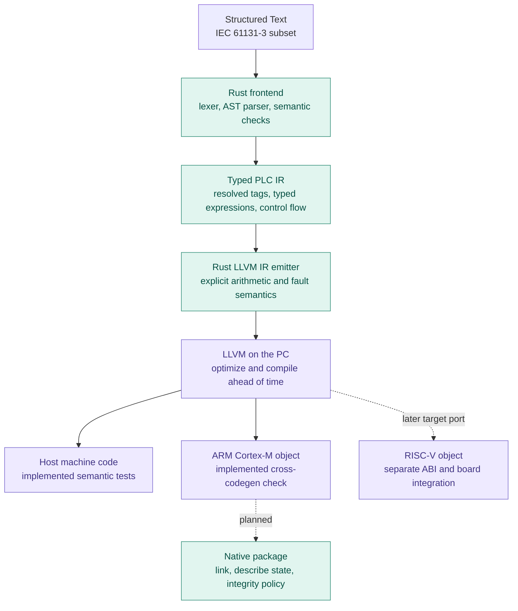
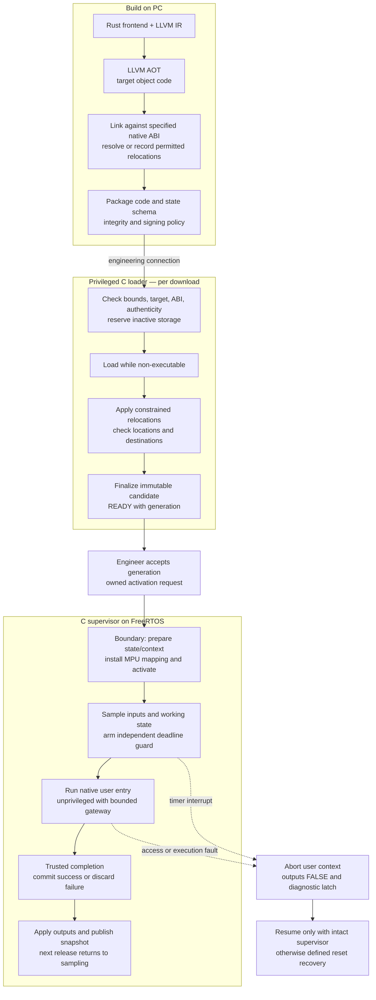

# Native PLC architecture and target roadmap

**Selected architecture:** ST → Rust frontend → typed PLC IR → LLVM IR →
ahead-of-time target machine code → C runtime on FreeRTOS. This is the primary
path, replacing the earlier proposal for a bytecode product with optional
native execution. R1 implements the frontend and host AOT stage. Packaging,
loading, RTOS execution, protection, and online changes remain planned.

## Established practice and our scope

CODESYS documents native code generators and downloaded application code for
supported CPU platforms. This establishes native compilation as a commercial
approach; it does not reveal its proprietary loader or isolation implementation,
or imply every PLC uses that approach. We do not rely on a market-share claim.
[CODESYS runtime brochure, pages 6 and 8](https://assets.ctfassets.net/qp8rp917jhxs/3Dn3l9I8dKZDdAlX6twLRw/9d0355f429f162805b155f0670ff39e9/CODESYS-Runtime-en.pdf).

IEC 61131-3 specifies PLC language syntax and semantics. The 2025 edition
covers ST, LD, FBD, and SFC structuring elements; it does not mandate LLVM or a
particular RTOS. tinyplc implements a deliberately small ST subset, not full
conformance. [IEC public scope](https://webstore.iec.ch/en/publication/68533).

## Learning controller versus product engineering

This comparison describes responsibility growth, not a mandatory ladder of
technologies. Rust and LLVM are our choices; neither is a certification.

| Layer | tinyplc native baseline | Research prototype | Product engineering |
| --- | --- | --- | --- |
| Engineering tool | Rust `plcc` CLI; C host demo | Download/activate/status/tag monitor, source maps, trends | Versioned projects, recovery, authorization, diagnostics, supported UI |
| Compiler | Rust parser and semantic analysis → typed PLC IR → LLVM IR | Expanded ST semantics, verified optimization and target ABI | Declared language coverage, reproducible builds, maintained target support |
| Artifact | LLVM IR and ARM relocatable object today | Defined native package, imports/relocations, state schema and authenticity policy | Key lifecycle, compatibility, power-loss and rollback strategy |
| Runtime/RTOS | Host C-compatible scan function; target supervisor planned | Static FreeRTOS tasks, native loader, MPU, checked services, deadline abort | Proven resource budgets, operational recovery, additional scan rates only when needed |
| Hardware | F446RE for initial native tests | More capacity/connectivity when justified by measurements | Engineered I/O/power, environmental/EMC evidence, manufacturing and service |
| Safety/security | Educational fault semantics | Fault injection, threat model, explicit limits | Requirements-driven assurance; functional safety, cybersecurity and EMC assessed separately |

A VM can be an appropriate choice elsewhere, but it is no longer tinyplc's
selected deployment path. Historical implementations remain test references.

## Compiler responsibilities



We implement PLC-to-LLVM-IR lowering and use LLVM's existing CPU backends; we
are not creating a new LLVM CPU target named tinyplc. LLVM supplies neither the
PLC scheduler nor the tag database or loader. A new CPU reuses frontend
semantics but still needs target features, data layout, ABI, linker, runtime
port and tests. [Clang cross-compilation](https://clang.llvm.org/docs/CrossCompilation.html),
[LLVM RISC-V target](https://llvm.org/docs/RISCVUsage.html).

R1 emits wrapping i32 arithmetic without overflow promises and checks zero
before division. It substitutes a safe divisor for `INT32_MIN / -1` so the
result wraps without executing undefined LLVM signed division. Eager logic
and source evaluation order are preserved. LLVM does not infer our language's
fault policy. [LLVM division semantics](https://llvm.org/docs/LangRef.html#sdiv-instruction).

## Native build, load, and execute

This diagram includes planned target work. A guard is armed **before** user
entry and can interrupt execution; it is not a test reached only after return.



An ELF `.o` is an intermediate object; it may contain unresolved relocations.
A desktop `.so` assumes services a bare MCU does not provide. A raw `.bin`
omits essential placement and ABI information unless an external contract
supplies it. R1 does not yet produce an uploadable package.

### Linking strategy and image checks

Start with a function linked for one reserved RAM address to isolate ABI and
instruction-fetch issues. Later choose slot-specific variants, constrained
position-independent code, or supported relocation records. A general ELF
dynamic loader is unnecessary for the first prototype.

The native contract must specify ISA/features, endianness, calling/float ABI,
entry offsets, code/constants/data/BSS sizes and alignment, state schema,
service imports, stack needs, and permitted fixups. For F446 the current
cross-codegen check uses `thumbv7em-none-eabi`, `cortex-m4`, Thumb, and soft-float
ABI. Audit any compiler-emitted helper calls rather than assuming libraries
exist on the controller.

Validate size/address arithmetic before copying and bound both relocation
patches and destinations. Authenticate original package bytes/metadata before
applying authorized fixups. A signature identifies an authorized key, not
correctness or termination. Signing, trusted boot, key lifecycle, command
permissions and rollback policy are distinct concerns. Unsigned lab steps
must remain explicitly labelled; CRC is not authentication.

### Tag memory, services, and protection

Use program-relative data offsets and a runtime-owned symbol dictionary.
R1 has fixed u32 cells and exports names/types/classes; the byte offset is
`4 * index`. The final package will carry a versioned schema. Do not compile
arbitrary privileged runtime or GPIO addresses into ST variables. New types
need explicit size/alignment rules; migration never copies raw pointers.

Target policy: frozen inputs read-only or accessed through a checked getter;
working data/stack writable and non-executable; finalized code read-only and
executable; runtime memory and peripherals inaccessible to user code. Stage
code non-executable. Budget regions with the RTOS and account for aliases and
DMA control. A CPU MPU does not govern every bus master.

A function-pointer table alone does not elevate privilege. Use a bounded
service gateway integrated with RTOS SVC handling, checking service IDs,
pointers, lengths and context. Services expose input snapshots, proposed
outputs and a defined scan clock. The supervisor alone commits physical I/O.
Use an MPU-aware FreeRTOS port and a protected return/abort path; the ordinary
ARM_CM4F port cannot simply be assumed sufficient. [ST PM0214](https://www.st.com/resource/en/programming_manual/dm00046982-stm32-cortexm4-mcus-and-mpus-programming-manual-stmicroelectronics.pdf).

### Deadline and fault recovery

Protect the guard from user interrupt/MPU reconfiguration. Bound privileged
service time and interrupt masking. After a contained application fault,
terminate the user context, discard working state, enforce output policy, and
publish diagnostics; do not return to the offending instruction.

Comms availability is a goal for contained user faults, not a promise for
arbitrary HardFaults, failed exception stacking or corrupted supervisor state.
Define reset/watchdog fallback and diagnostic retention. Feed the watchdog
only while the controller makes bounded progress, including a responsive
FAULT loop holding outputs FALSE. Neither an MPU nor reset guarantees
physical safety.

## F446 feasibility and memory budget

ST documents a Cortex-M4F, eight-region MPU, 512 KB flash for the RE device,
and 128 KB main SRAM (112 KB SRAM1 + 16 KB SRAM2), plus backup SRAM.
SRAM1 spans `0x20000000..0x2001BFFF`; SRAM2 extends through `0x2001FFFF`.
ST also documents SRAM code execution. Use a reserved SRAM1 block for initial
experiments and confirm instruction fetch and permissions on the actual board.
Do not import CCM restrictions from other F4 variants.
[DS10693 §§3.3, 3.6 and memory map](https://www.st.com/resource/en/datasheet/stm32f446re.pdf).

The MPU requires suitable power-of-two region sizes/alignment; its eight
regions must also serve the RTOS. Plan protected supervisor memory, user code,
working state, stack and gateway access together. Follow synchronization rules
when changing protection. M4 avoids the M7-style L1 cache maintenance issue,
but still needs memory-system analysis and barriers.
[PM0214 memory/MPU sections](https://www.st.com/resource/en/programming_manual/dm00046982-stm32-cortexm4-mcus-and-mpus-programming-manual-stmicroelectronics.pdf).

The current linker script is the M0 blink layout, without native partitions.
Introduce a measured target layout with assertions; do not reserve speculative
large slots now. The board need not change for the first native experiment.
New memory, networking, I/O or protection requirements may later justify a
larger ARM or RISC-V board with its own acceptance evidence.

## Repository structure

```text
compiler/                         primary Rust compiler (implemented)
  src/lexer.rs, parser.rs         positioned syntax frontend
  src/semantic.rs, ir.rs          type checking and resolved PLC IR
  src/llvm.rs                    LLVM textual IR emission
  src/main.rs                    plcc CLI
  scan_abi.h                     research C call/metadata contract
sim/aot_main.c                    implemented statically linked host AOT demo
tests/llvm/                      verifier, host execution, ARM object checks
port/nucleo_f446re/               existing blink; future native C runtime port
  native/                        proposed loader/MPU/gateway/guard implementation
docs/                            current contracts and stage reports
core/, host/, tests/native/       historical implementations used by tests
```

Keep the selected compiler and runtime in this repository. Add target-specific
loader code when implemented; do not advertise placeholder capabilities.
Python is a test-runner/oracle dependency, not the production ST compiler.
Rust uses no third-party crates; LLVM runs on the PC, not the microcontroller.

## Implementation gates

| Stage | Acceptance gate |
| --- | --- |
| R1 | Typed Rust frontend, LLVM verification, host AOT semantics at O0/O2, tag ABI, ARM object generation |
| R2 | Freeze native ABI/state/package requirements; measure memory; execute a small linked native function on F446; prove privileged supervision, user isolation, deadline abort and reset fallback |
| R3 | Bounded native loading/relocations, integrity policy, upload/activation CLI, snapshots and coherent monitoring |
| R4 | State migration, reserved first-scan trial, rollback, concurrent update/fault tests |
| R5 | Expanded IEC subset, source tooling and additional targets with their own validation |

The test corpus remains reusable. Native fault locations need source IDs or
ARM PC mapping, not bytecode PC equality. Host execution does not verify ARM
ABI details, MPU behavior or timing; hardware tests must exercise the actual
loaded artifact. [R1 report](R1-report.md) records the present boundary.

See [references and acknowledgments](references.md) for related work and official
technology documentation, and [tasks](tasks.md) for implementation status.

R2.1 has frozen the [call ABI draft](native-abi.md) and added host/ARM contract
fixtures. This does not complete the R2 hardware or package acceptance gate.

R2.3/R2.4 update: the selected MPU port now links, and ABI 2 ST-generated code
runs from SRAM under a privileged FreeRTOS task. See [hardware evidence](R2.4-report.md).
This advances the prototype; the full R2 protection/deadline gate remains open.

R2.5 update: the privileged board scan now uses physical GPIO, separate working/
committed state, latched faults and measured release timing. See the
[scan design](scan-runtime.md) and [hardware report](R2.5-report.md). R2.6
isolation and deadline abort remain unimplemented.
