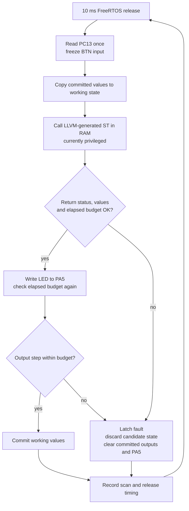

# Scan supervision: R2.5

The portable [C scan module](../runtime/src/scan.c) owns committed state and the
fault latch. The [board port](../port/nucleo_f446re/native/main.c) owns GPIO,
DWT timing and the static FreeRTOS task. Compiled ST receives frozen inputs
and a disposable working buffer through ABI 2. No heap allocation is used.

Once faulted, later releases keep outputs off and never call user logic.
Reinitialization/reset is the only recovery operation currently exposed. VAR
values survive a failed scan; all values initialize to zero on reset. Output
cells are cleared on faults, including a failed program that previously drove
an output high. Unknown nonzero native statuses also latch. The supervisor
checks canonical BOOL values and rejects writes to reserved INPUT working
cells. This is a transaction contract, not protection against arbitrary native
writes; the current task is privileged. R2.6 supplies the isolation boundary.

The GPIO port matches `boards/nucleo_f446re.json`: PC13 is an input, inverted
into BOOL BTN; PA5 drives LD2. The GPIO latch is cleared before enabling output
mode. No software debounce is provided. In `button_led.st`, LED is `NOT BTN`
and N counts **scans while pressed**, not button edges.

The cycle clock is the DWT 32-bit counter at the nominal 16 MHz HSI clock.
Unsigned subtraction handles wrap for intervals shorter than one counter
period. The 160,000-cycle budget is checked after native return and after the
output write. A slow output callback can briefly apply a value before the
second check clears it. Non-returning native code cannot be interrupted by
these checks. Neither behavior substitutes for R2.6's independent deadline
guard and watchdog.

`scan_cycles_max` measures from before GPIO acquisition through supervisor
execution, physical output writes, state commit and publication of counter/
output fields. It excludes stack high-water probing, the final timing-statistic
update and scheduler blocking. Release period and absolute deviation from
160,000 cycles are measured separately. These debugger-readable fields are
owned by one task; they are not the future concurrent monitoring snapshot.
A missed FreeRTOS release latches an overrun, clears PA5 and skips catch-up
bursts. Static task allocation is established; a communication task is R3.

## Tests and sources

`make test-scan` uses address/undefined-behavior sanitizers to exercise dirty
failed candidates, preserved VAR state, cleared outputs, persistent faults,
reset, invalid input/working BOOLs, reserved input writes, unknown status,
invalid layout, expired deadlines, slow output writes and cycle wrap.
[R2.5 hardware evidence](R2.5-report.md) records the separate board tests.

This is project-owned code. Scan ownership and fault policy are motivated by
PLC execution principles discussed in [related work](references.md), with no
OpenPLC or other runtime source copied. Hardware/API references:

- [ST UM1724, sections 7.6–7.7](https://www.st.com/resource/en/user_manual/um1724-stm32-nucleo64-boards-mb1136-stmicroelectronics.pdf): LD2 and user-button pin connections.
- [ST RM0390](https://www.st.com/resource/en/reference_manual/rm0390-stm32f446xx-advanced-armbased-32bit-mcus-stmicroelectronics.pdf): GPIO and RCC registers.
- [ST PM0214](https://www.st.com/resource/en/programming_manual/pm0214-stm32-cortexm4-mcus-and-mpus-programming-manual-stmicroelectronics.pdf): Cortex-M4 programmer's model and debug facilities.
- [FreeRTOS xTaskDelayUntil](https://www.freertos.org/Documentation/02-Kernel/04-API-references/02-Task-control/03-xTaskDelayUntil): fixed-period scheduling and missed-wake return behavior.
