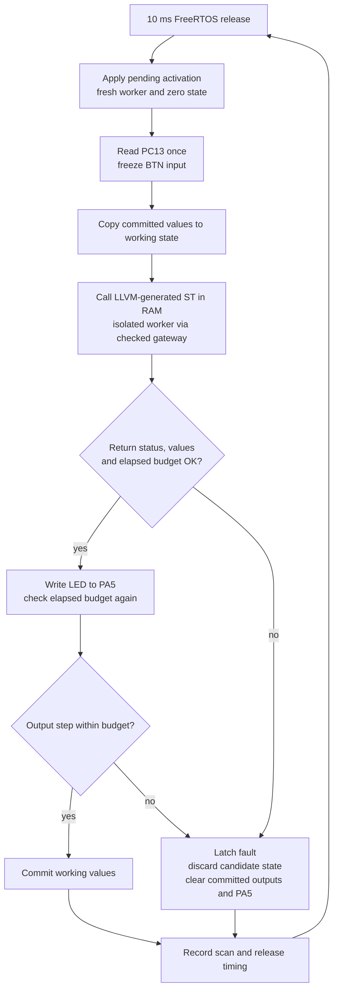

# Scan supervision: transaction core

R2.5 established this transaction. R2.6 now routes its entry callback through
a [separate unprivileged worker and deadline guard](native-isolation.md).
R3.3 adds [boundary activation and serial status](engineering-transport.md).

The portable [C scan module](../runtime/src/scan.c) owns committed state and the
fault latch. The [board port](../port/nucleo_f446re/native/main.c) owns GPIO,
DWT timing and the static FreeRTOS task. Compiled ST receives frozen inputs
and a disposable working buffer through ABI 2. No heap allocation is used.

Once faulted, later releases keep outputs off and never call user logic.
Reinitialization/reset is the only recovery operation currently exposed. VAR
values survive a failed scan; all values initialize to zero on reset. Output
cells are cleared on faults, including a failed program that previously drove
an output high. Unknown nonzero native statuses also latch. The supervisor
checks canonical BOOL and TIME values and rejects writes to reserved INPUT working
cells. This is a transaction contract, not protection against arbitrary native
writes; the portable module alone cannot contain arbitrary native writes. The STM32
port now supplies the R2.6 isolation boundary.

The GPIO port matches `boards/nucleo_f446re.json`: PC13 is an input, inverted
into BOOL BTN; PA5 drives LD2. The GPIO latch is cleared before enabling output
mode. No software debounce is provided. In `button_led.st`, LED is `NOT BTN`
and N counts **scans while pressed**, not button edges.

The cycle clock is the DWT 32-bit counter at the nominal 16 MHz HSI clock.
Unsigned subtraction handles wrap for intervals shorter than one counter
period. The 160,000-cycle budget is checked after native return and after the
output write. A slow output callback can briefly apply a value before the
second check clears it. These checks alone cannot interrupt non-returning native code. The STM32
entry callback now adds R2.6's independent deadline guard and watchdog.
The timer guards the native job; trusted supervisor work after return still
uses elapsed checks and watchdog fallback.

`scan_cycles_max` measures from before GPIO acquisition through supervisor
execution, physical output writes, state commit and publication of counter/
output fields, plus owned tag snapshot publication in R3.4. It excludes stack high-water probing, the final timing-statistic
update and scheduler blocking. Release period and absolute deviation from
160,000 cycles are measured separately. These debugger-readable fields are
owned by one task; R3.4 uses a separate owned mailbox for concurrent tag monitoring.
R3.5 adds `scan_body_cycles_last` and `scan_body_cycles_max`. They measure from
scan release handling through activation, GPIO, user execution, state commit,
snapshot/status publication, watchdog heartbeat and both stack high-water
checks, immediately before `xTaskDelayUntil`. They exclude the final measurement
stores, the scheduler call itself and blocked time. Thus the body duration and
the release period are separate measurements; the original wire status timing
fields keep their existing, narrower meaning. See [R3.5 evidence](R3.5-report.md).

A missed FreeRTOS release latches an overrun, clears PA5 and skips catch-up
bursts. Static task allocation and the lower-priority communication task are established.

## Tests and sources

`make test-scan` uses address/undefined-behavior sanitizers to exercise dirty
failed candidates, preserved VAR state, cleared outputs, persistent faults,
reset, invalid input/working BOOLs, reserved input writes, unknown status,
invalid layout, expired deadlines, slow output writes and cycle wrap.
[R2.5 hardware evidence](R2.5-report.md) records the separate board tests.

This is project-owned code. Scan ownership and fault policy are motivated by
PLC execution principles discussed in [related work](references.md), with no
OpenPLC or other runtime source copied. Hardware/API references:

- [ST UM1724, sections 7.6–7.7](https://www.st.com/resource/en/user_manual/um1724-stm32-nucleo64-boards-mb1136-stmicroelectronics.pdf): LD2 and user-button pin connections.
- [ST RM0390](https://www.st.com/resource/en/reference_manual/rm0390-stm32f446xx-advanced-armbased-32bit-mcus-stmicroelectronics.pdf): GPIO and RCC registers.
- [ST PM0214](https://www.st.com/resource/en/programming_manual/pm0214-stm32-cortexm4-mcus-and-mpus-programming-manual-stmicroelectronics.pdf): Cortex-M4 programmer's model and debug facilities.
- [FreeRTOS xTaskDelayUntil](https://www.freertos.org/Documentation/02-Kernel/04-API-references/02-Task-control/03-xTaskDelayUntil): fixed-period scheduling and missed-wake return behavior.

## R4 boundary transactions

R4 resolves the preceding trial at the next release after the actual scheduler
admission result, before applying a pending migration/restoration. Both slots
stay reserved through that point. Resolution and the next preparation are
included in that release's whole-body counter. Precomputed name maps keep the
quadratic schema search in the lower-priority comms task. Late trial overruns
restore initialized trial VARs before corrected fault publication, while the
physical fault policy immediately clears outputs. See [R4.2](R4.2-report.md)
and [R4.3 board evidence](R4.3-report.md).
